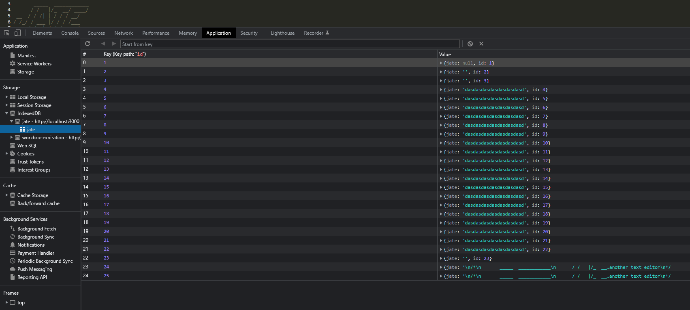

# Text-EditorPWA
#
## App Link
link -  https://lit-sands-37415.herokuapp.com/
#
## Description
 This application or also known as JATE, is a simple text editor that can function both online and offline after a simple app install. It helps users create and take notes with or wihtout connection and can retrieve later.
#
## Installation
1. `git clone` the repo to your local machine.

2. Run a `npm install`

3. Then run the command: `npm run:dev`
#
## Usage
To run the application , type in your terminal : `npm run start` ,
open up the application in `http://localhost:3000/ `.
#
## Badges
   
                                                                                

#
## Visuals

Showing the applications Service Workers

Showing the applications Manifest

Showing the applications IndexedDB

Showing the applications Performance Rating

.png)
Showing the applications Opportunities
#
## License
[MIT](./license.md)
